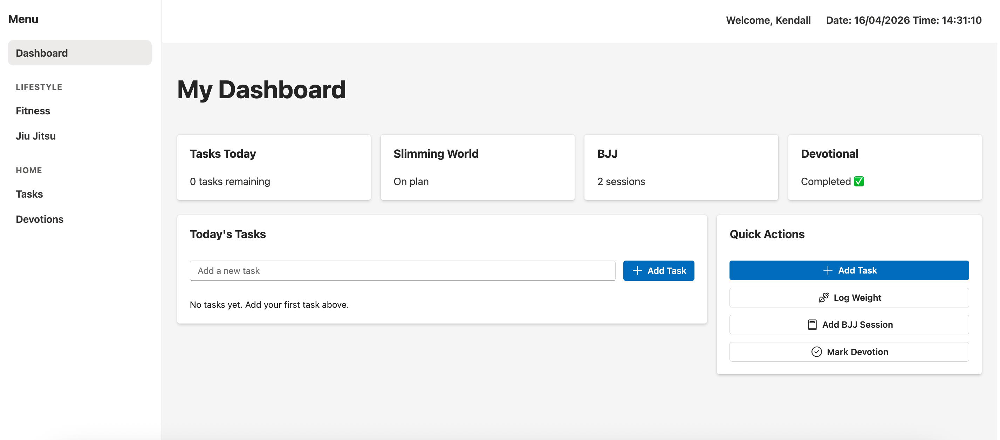
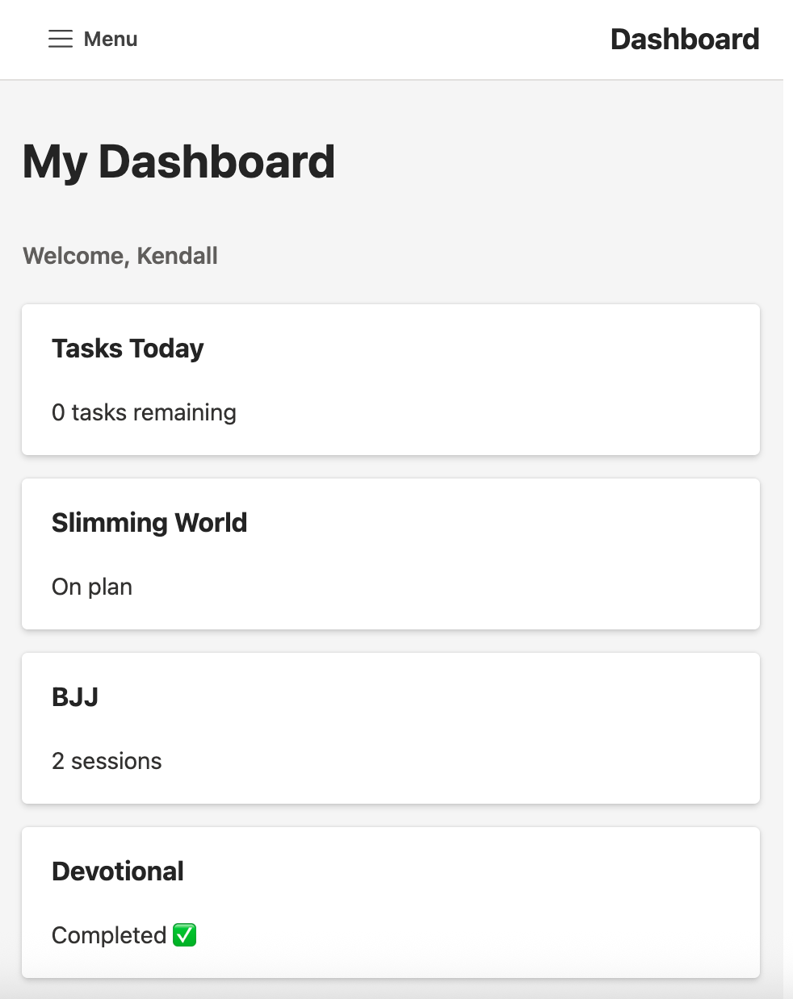

# 🧠 Personal Dashboard App

A responsive dashboard application built with **React** and **TypeScript**, designed to manage daily tasks and track simple personal metrics.

---

## 🚀 Features

- ✅ Add, complete, and delete tasks  
- 💾 Task persistence using `localStorage`  
- 📱 Fully responsive layout (desktop, tablet, mobile)  
- 🎯 Clean and reusable component structure  
- ⚡ Fast and simple user interactions  

---

## 🛠️ Tech Stack

- **Frontend:** React, TypeScript  
- **UI Library:** Fluent UI  
- **State Management:** React Hooks (`useState`, `useEffect`, `useMemo`)  
- **Persistence:** Browser `localStorage`  

---

## 📸 Screenshots




---

## 🧠 Key Learnings

This project helped me develop a stronger understanding of:

- Managing state effectively in React  
- Using `useEffect` to persist data  
- Structuring components for readability and reuse  
- Building responsive layouts with modern CSS techniques  
- Handling user input and real-time UI updates  

---

## ⚙️ How It Works

- Tasks are stored in React state and synchronised with `localStorage`  
- On page load, tasks are retrieved from `localStorage`  
- Any updates to tasks automatically update stored data  
- The UI updates dynamically based on user actions  

---

## 🧪 Future Improvements

- Edit existing tasks  
- Add due dates or categories  
- Backend integration (Node.js API)  
- User authentication  
- Deployment (e.g. Vercel / AWS)

---

## 📦 Getting Started

```bash
# Clone the repository
git clone https://github.com/kendallgmasonE/DadLife.git

# Install dependencies
npm install

# Run the app
npm start
